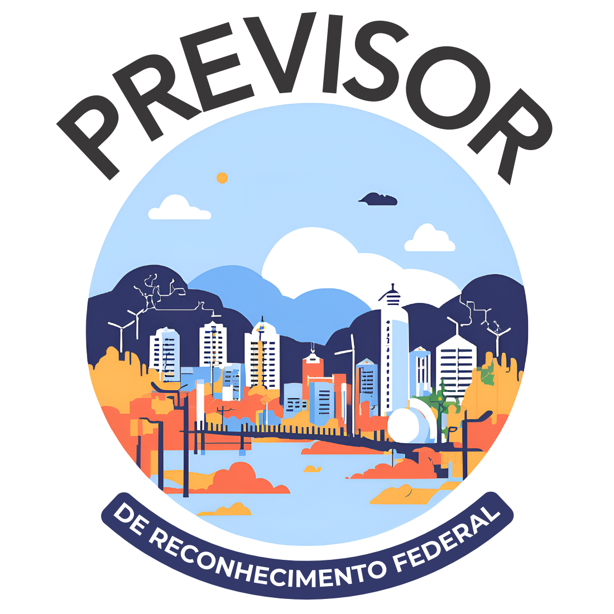

  

<h1 align="center">Análise Preditiva do Reconhecimento Federal de Desastres</h1>

## O projeto

O projeto proposto tem como objetivo auxiliar a tarefa de reconhecimento federal de desastres como situações de emergência ou estado de calamidade pública. 

Se não realizado de forma tempestiva, o processo de análise pode afetar a rapidez com que recursos e assistência chegam às áreas afetadas. Com a aplicação de técnicas de Machine Learning, pretende-se agilizar esse processo, proporcionando benefícios significativos para os órgãos governamentais envolvidos no processo de reconhecimento e para a população impactada. 

A relevância desse problema é alta, pois respostas mais rápidas podem minimizar os danos e acelerar a recuperação das regiões afetadas. Além disso, a solução pode ser generalizada e aplicada a outros tipos de desastres e em diferentes regiões.

## Solução proposta

A solução proposta envolve o treinamento de modelos supervisionados de classificação para prever o reconhecimento federal de desastres a partir de dados históricos de desastres e de variáveis socioeconômicas. 

Foram utilizados algoritmos de regressão logística, árvore de decisão, Random Forest e XGBoost para criar modelos preditivos. 

Também foram aplicadas técnicas de processamento de linguagem natural, como BERT e TF-IDF, para analisar as descrições textuais dos eventos. Os modelos foram avaliados quanto ao f1 score, recall e outras métricas relevantes.

## Fontes de dados

Os dados utilizados são públicos e foram obtidos de fontes oficiais, como o Atlas Digital de Desastres do Ministério da Integração e Desenvolvimento Regional e do Cadastro Único (CadÚnico). Dados adicionais foram coletados do IBGE, incluindo o Censo de 2010 e 2022, e estimativas populacionais. Os dados abrangem o período de 2010 a 2024.

## Resultados

Visualize os resultados acessando os links abaixo:

- [Caderno JupyterBook com resultados iniciais dos modelos testados](https://brunagmoura.github.io/PrevisorReconhecimento/content.html)

- [Simulador de reconhecimento federal](https://reconhecimentofederal.streamlit.app)
- 

  

