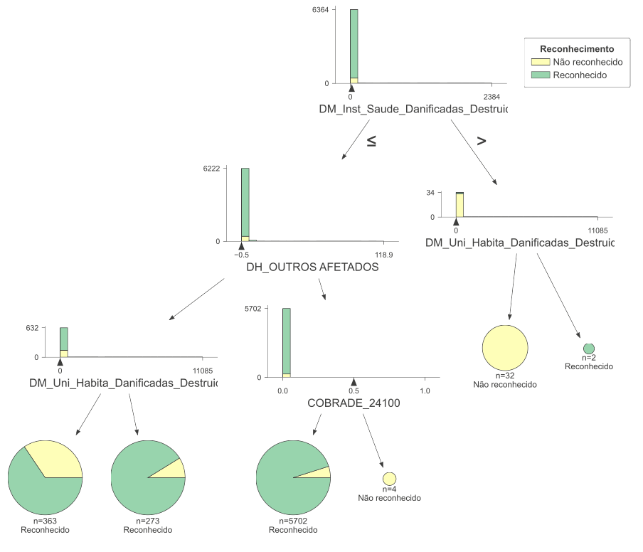

# Resultados dos Modelos de Árvores de Decisão

## Conjuntos de Dados Testados:
- **Features agregadas** com eventos de 2010 a 2017.
- **Features agregadas** com eventos de 2018 a 2024.
- **Features desagregadas** com eventos de 2010 a 2017.
- **Features desagregadas** com eventos de 2018 a 2024.

## Métricas Analisadas:
- **Precision**: Proporção de previsões positivas que realmente são positivas.
- **Recall**: Proporção de casos positivos corretamente identificados.
- **F1 Score**: Média harmônica entre precisão e recall.
- **Weighted Avg Recall**: Recall ponderado considerando o desbalanceamento das classes.

## Comparação de Modelos

## Variáveis Agregadas (2010-2017)

| Modelo                            | Precision (Não Reconhecido) | Recall (Não Reconhecido) | F1-score (Não Reconhecido) | Precision (Reconhecido) | Recall (Reconhecido) | F1-score (Reconhecido) | Weighted Avg Recall | Weighted F1  |
|------------------------------------|-----------------------------|---------------------------|----------------------------|--------------------------|----------------------|-------------------------|---------------------|--------------|
| Sem Balanceamento                  | 0.714286                    | 0.020747                  | 0.040323                   | 0.884540                 | 0.998895             | 0.938246                | 0.883959            | 0.832737     |
| SMOTE                              | 0.187970                    | 0.207469                  | 0.197239                   | 0.892997                 | 0.880663             | 0.886787                | 0.801560            | 0.805763     |
| Balanceado por Pesos               | 1.000000                    | 0.004149                  | 0.008264                   | 0.882927                 | 1.000000             | 0.937824                | **0.882984**        | 0.828597     |
| Balanceado com Variáveis Selecionadas | 0.000000                    | 0.000000                  | 0.000000                   | 0.882496                 | 1.000000             | 0.937581                | **0.882496**        | 0.827412     |

## Variáveis Agregadas (2018-2024)

| Modelo                            | Precision (Não Reconhecido) | Recall (Não Reconhecido) | F1-score (Não Reconhecido) | Precision (Reconhecido) | Recall (Reconhecido) | F1-score (Reconhecido) | Weighted Avg Recall | Weighted F1  |
|------------------------------------|-----------------------------|---------------------------|----------------------------|--------------------------|----------------------|-------------------------|---------------------|--------------|
| Sem Balanceamento                  | 0.442308                    | 0.110048                  | 0.176245                   | 0.925241                 | 0.987559             | 0.955385                | 0.915354            | 0.891275     |
| SMOTE                              | 0.279412                    | 0.272727                  | 0.276029                   | 0.934932                 | 0.936937             | 0.935933                | 0.882283            | 0.881634     |
| Balanceado por Pesos               | 0.000000                    | 0.000000                  | 0.000000                   | 0.917717                 | 1.000000             | 0.957093                | **0.917717**        | 0.878340     |
| Balanceado com Variáveis Selecionadas | 0.428571                    | 0.014354                  | 0.027778                   | 0.918674                 | 0.998284             | 0.956826                | **0.917323**        | 0.880380     |

## Variáveis Desagregadas (2010-2017)

| Modelo                            | Precision (Não Reconhecido) | Recall (Não Reconhecido) | F1-score (Não Reconhecido) | Precision (Reconhecido) | Recall (Reconhecido) | F1-score (Reconhecido) | Weighted Avg Recall | Weighted F1  |
|------------------------------------|-----------------------------|---------------------------|----------------------------|--------------------------|----------------------|-------------------------|---------------------|--------------|
| Sem Balanceamento                  | 0.818182                    | 0.060403                  | 0.112500                   | 0.896831                 | 0.998359             | 0.944876                | **0.896199**        | 0.854215     |
| SMOTE                              | 0.336842                    | 0.214765                  | 0.262295                   | 0.908091                 | 0.948318             | 0.927769                | 0.868421            | 0.855287     |
| Balanceado por Pesos               | 0.413043                    | 0.127517                  | 0.194872                   | 0.901664                 | 0.977851             | 0.938213                | **0.885234**        | 0.857250     |
| Balanceado com Variáveis Selecionadas | 1.000000                    | 0.020134                  | 0.039474                   | 0.893040                 | 1.000000             | 0.943498                | **0.893275**        | 0.845034     |

## Variáveis Desagregadas (2018-2024)

| Modelo                                   | Precision (Não Reconhecido) | Recall (Não Reconhecido) | F1-score (Não Reconhecido) | Precision (Reconhecido) | Recall (Reconhecido) | F1-score (Reconhecido) | Weighted Avg Recall | Weighted F1 |
|------------------------------------------|-------------------------|----------------------|------------------------|----------------------|-----------------|--------------------|-----------------|----------|
| Sem Balanceamento                        | 0.960000                | 0.192000             | 0.320000               | 0.935628             | 0.999319        | 0.966425           | **0.936010**    | 0.915733 |
| SMOTE                                    | 0.319728                | 0.376000             | 0.345588               | 0.946095             | 0.931926        | 0.938957           | 0.888331        | 0.892426 |
| Balanceado por Pesos                     | 0.944444                | 0.136000             | 0.237762               | 0.931472             | 0.999319        | 0.964204           | **0.931619**    | 0.907237 |
| Balanceado com Variáveis Selecionadas    | 1.000000                | 0.136000             | 0.239437               | 0.931516             | 1.000000        | 0.964544           | **0.932246**    | 0.907681 |
| Balanceado com Variáveis Transformadas** | 1.000000                | 0.096000             | 0.175182               | 0.928571             | 1.000000        | 0.962963           | 0.929109        | 0.901186 |

** Transformações realizadas:

| Nova Variável                               | Agregação                                                                                         |
|---------------------------------------------|---------------------------------------------------------------------------------------------------|
| DH_FERIDOS_ENFERMOS                         | DH_FERIDOS + DH_ENFERMOS                                                        |
| DH_DESABRIGADOS_DESALOJADOS                 | DH_DESABRIGADOS + DH_DESALOJADOS                                               ||
| DM_Uni_Habita_Danificadas_Destruidas        | DM_Uni Habita Danificadas + DM_Uni Habita Destruidas                           ||
| DM_Inst_Saude_Danificadas_Destruidas        | DM_Inst Saúde Danificadas + DM_Inst Saúde Destruidas                           ||
| DM_Inst_Ensino_Danificadas_Destruidas       | DM_Inst Ensino Danificadas + DM_Inst Ensino Destruidas                         | |
| DM_Inst_Servicos_Danificadas_Destruidas     | DM_Inst Serviços Danificadas + DM_Inst Serviços Destruidas                     ||
| DM_Inst_Comuni_Danificadas_Destruidas       | DM_Inst Comuni Danificadas + DM_Inst Comuni Destruidas                       | |
| DM_Obras_Infra_Danificadas_Destruidas       | DM_Obras de Infra Danificadas + DM_Obras de Infra Destruidas                  | |

### Árvore 2018-2024 com variáveis desagregadas transformadas

  |

- A primeira decisão da árvore é baseada na quantidade de instituições de saúde danificadas ou destruídas. 
  - Se a quantidade for baixa, a árvore segue à esquerda e usa a variável DH_OUTROS_AFETADOS para uma nova decisão. Se o valor dessa variável for baixo, utiliza a quantidade de habitações danificadas e destruídas. Se essa também for baixa, o evento pode ser reconhecido, mas há uma certa proporção não reconhecida.
  - Se a quantidade de instituições de saúde danificadas e destruídas for alta, mas a quantidade de unidades de habitação danificadas e destruídas for baixa, há uma maior tendência ao não reconhecimento.
- Se a quantidade de instituições de saúde danificadas ou destruídas for baixa, mas quantidade de outros afetados for. alta e o evento não for erosão (Cobrade 24100), a decisão seria pelo reconhecimento.

## Importância das Variáveis (Modelos com definição de hiperparâmetros, Balanceamento por Pesos, Seleção de Variáveis)

| **Feature**                              | **Agregado 2010-2017** | **Agregado 2018-2024** | **Desagregado 2010-2017** | **Desagregado 2018-2024** |
|------------------------------------------|------------------------|------------------------|---------------------------|---------------------------|
| PEPR_total_privado                       | **0.419349**           | **0.267709**           | -                         | -                         |
| Rendapercapita                           | 0.219838               | -                      | 0.211740                  | -                         |
| DH_total_danos_humanos                   | **0.187282**           | **0.681237**           | -                         | -                         |
| PEPL_total_publico                       | 0.117049               | -                      | -                         | -                         |
| DM_total_danos_materiais                 | 0.056482               | 0.033385               | 0.041523                  | -                         |
| PDEFESGOTO                               | -                      | 0.017669               | -                         | -                         |
| PEPR_Agricultura (R$)                    | -                      | -                      | 0.344319                  | -                         |
| Sigla_UF_TO                              | -                      | -                      | 0.225400                  | -                         |
| PEPL_Abast de água pot(R$)               | -                      | -                      | 0.106759                  | -                         |
| DensidadePop                             | -                      | -                      | 0.070259                  | -                         |
| DM_Inst Saúde Destruidas                 | -                      | -                      | -                         | 0.581018                  |
| DM_Uni Habita Destruidas                 | -                      | -                      | -                         | 0.139474                  |
| DH_OUTROS AFETADOS                       | -                      | -                      | -                         | 0.106050                  |
| COBRADE_11410 (Erosão costeira)          | -                      | -                      | -                         | 0.075611                  |
| COBRADE_24100 (Queda de estrutura civil) | -                      | -                      | -                         | 0.068325                  |
| DM_Inst Saúde Valor                      | -                      | -                      | -                         | 0.029520                  |

Parece haver uma certa mudança de foco ao longo do tempo

- 2010-2017: O foco foi principalmente nas perdas econômicas, tanto no setor privado quanto no setor público. Em termos desagregados, as perdas no setor agrícola  foram importantes, sugerindo que o impacto econômico pesava nas decisões.
- 2018-2024: O foco passou a ser significativamente mais relacionado aos danos humanos, o que pode refletir uma mudança nos critérios de reconhecimento federal. Em termos desagregados, há especial atenção aos danos à infraestrutura de saúde e o impacto em habitações, indicando uma ênfase nas consequências sociais e humanas dos desastres.

## Análise e Conclusões:

*Foco nas Perdas Econômicas (2010-2017)*
- Nos anos de 2010 a 2017, tanto nos modelos com variáveis agregadas quanto desagregadas, os fatores econômicos foram decisivos. Variáveis como PEPR_total_privado e PEPL_total_publico, que representam perdas econômicas no setor privado e público, tiveram grande relevância na classificação dos desastres.
- Em particular, nas análises desagregadas, as perdas relacionadas à agricultura e a renda per capita desempenharam um papel importante, sugerindo que o impacto econômico regional influenciava significativamente a decisão de reconhecimento.

*Mudança para Danos Humanos e Infraestrutura (2018-2024)*
- Entre 2018 e 2024, houve uma mudança notável no foco, que passou a ser muito mais relacionado aos danos humanos e à infraestrutura, em vez de apenas às perdas econômicas. Variáveis como DH_total_danos_humanos e DM_Inst_Saude_Danificadas_Destruidas passaram a ter uma importância significativa.
- Esta mudança pode refletir uma alteração nos critérios de reconhecimento, com uma maior ênfase nas consequências sociais dos desastres, como danos em habitações, infraestrutura de saúde

*Desempenho dos Modelos e Técnicas de Balanceamento*

- Em todos os períodos analisados, os modelos sem balanceamento tendem a apresentar um desempenho muito mais alto na classe "Reconhecido", mas falham ao prever corretamente a classe "Não reconhecido", evidenciado pelo baixo recall dessa classe.
- A aplicação de técnicas de balanceamento, como o SMOTE e o balanceamento por pesos, trouxe algumas melhorias no recall da classe "Não reconhecido", mas frequentemente em detrimento da precisão ou do F1-Score.
- O uso de variáveis selecionadas e transformadas levou a uma melhoria modesta, mas consistente, no desempenho geral, ao manter um equilíbrio entre as classes. O modelo com variáveis transformadas apresentou um weighted F1 equilibrado e manteve um weighted avg recall de 0.929109.
