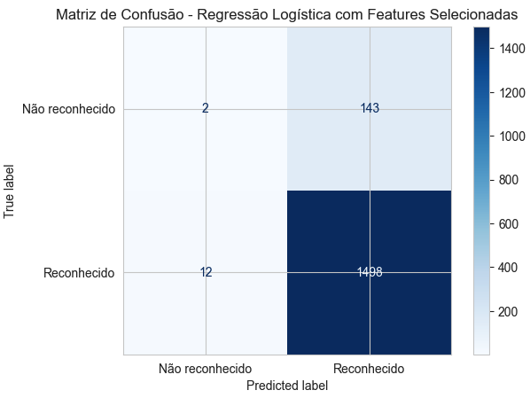

# Resultados da Regressão Logística

Com base nas especificidades identificadas na base de dados, foram realizados testes utilizando quatro conjuntos de dados distintos:

1. Features agregadas com eventos ocorridos entre 2010 e 2017.
2. Features desagregadas com eventos ocorridos entre 2010 e 2017.
3. Features agregadas com eventos ocorridos entre 2018 e 2024.
4. Features desagregadas com eventos ocorridos entre 2018 e 2024.

> **Nota**: Mais detalhes sobre o pré-processamento dos dados podem ser verificados no capítulo "Pré-processamento".

## Tabela Comparativa dos Modelos 

Como forma de avaliar os modelos de regressão logística, usamos a métrica **'recall weighted average'**, ou média ponderada de recall (revocação). 

Recall, também conhecido como sensibilidade ou taxa de verdadeiros positivos (TPR), mede a proporção de positivos reais que são corretamente identificados pelo modelo. Essa métrica destaca quão bem o modelo captura todas as instâncias relevantes, o que é crucial em cenários onde perder uma instância positiva (falso negativo) é mais crítico do que rotular incorretamente uma instância negativa como positiva (falso positivo). No contexto de desastres reportados, o não reconhecimento de um desastre legítimo (perder uma instância positiva) seria bastante crítico.

Na classificação multiclasse, calcular uma única pontuação de recall pode ser desafiador devido às diferentes distribuições das classes. A **média ponderada de recall** aborda isso considerando o número de instâncias verdadeiras para cada classe, dando mais importância às classes com mais ocorrências. No conjunto de dados do reconhecimento de desastres, verificou-se que as classes estão desbalanceadas numa proporção aproximada de 10:1, onde a classe minoritária é a classe  de evento 'Não reconhecido'.

### Resultados dos Modelos de Classificação - **Modelo base**

O algoritmo de regressão logística foi aplicado nos 4 conjuntos de dados com os seguintes parâmetros:

* max_iter=1000, 
* random_state=42, 
* solver="liblinear", 
* class_weight={0: 5, 1: 1} 

A seguir, o resultado das métricas de avaliação:

### 2010-2017 Agregado

|                     | precision | recall    | f1-score | support |
|---------------------|-----------|-----------|----------|---------|
| **Não reconhecido** | 0.286     | 0.034     | 0.061    | 234     |
| **Reconhecido**     | 0.912     | 0.992     | 0.950    | 2376    |
| **accuracy**        |     0.906      | 0.906     | 0.906    | 2610    |
| **macro avg**       | 0.599     | 0.513     | 0.506    | 2610    |
| **weighted avg**    | 0.856     | **0.906** | 0.871    | 2610    |

### 2010-2017 Desagregado

|                     | precision | recall    | f1-score | support |
|---------------------|-----------|-----------|----------|---------|
| **Não reconhecido** | 0.167     | 0.028     | 0.048    | 144     |
| **Reconhecido**     | 0.917     | 0.987     | 0.951    | 1576    |
| **accuracy**        |   0.907        | 0.907     | 0.907    | 1720    |
| **macro avg**       | 0.542     | 0.508     | 0.499    | 1720    |
| **weighted avg**    | 0.855     | **0.907** | 0.875    | 1720    |

### 2018-2024 Agregado

|                     | precision | recall    | f1-score | support |
|---------------------|-----------|-----------|----------|---------|
| **Não reconhecido** | 0.750     | 0.056     | 0.103    | 216     |
| **Reconhecido**     | 0.922     | 0.998     | 0.959    | 2418    |
| **accuracy**        |      0.921     | 0.921     | 0.921    | 2634    |
| **macro avg**       | 0.836     | 0.527     | 0.531    | 2634    |
| **weighted avg**    | 0.908     | **0.921** | 0.889    | 2634    |

### 2018-2024 Desagregado

|                     | precision | recall    | f1-score | support |
|---------------------|-----------|-----------|----------|---------|
| **Não reconhecido** | 0.237     | 0.128     | 0.166    | 149     |
| **Reconhecido**     | 0.917     | 0.959     | 0.938    | 1506    |
| **accuracy**        |   0.885        | 0.885     | 0.885    | 1655    |
| **macro avg**       | 0.577     | 0.544     | 0.552    | 1655    |
| **weighted avg**    | 0.856     | **0.885** | 0.868    | 1655    |

Nessa análise, o conjunto de dados 3 (2018 a 2024 - agregado) apresentou os melhores resultados, com o **recall weighted avg** de 92,1%, .
Vale ressaltar que, mesmo para os conjuntos de dados com melhor resultado, a acurácia para a classe 'Não reconhecido' foi muito baixa (5,6%), conforme exemplificado nas matrizes de confusão abaixo:

|  |  |
|:------------------------------------------------------------------------------------------------------------:|:------------------------------------------------------------------------------------------------------:|
|                              Matriz de Confusão - Dados desagregados 2010-2017                               |                             Matriz de Confusão - Dados agregados 2018-2024                             |

### Resultados dos Modelos de Classificação - **Modelo com hiperparâmetros**

Já nesse análise, buscamos encontrar os melhores parâmetros para o algoritmo de regressão logística usando a técnica do *GridSearchCV*. Para cada conjunto de dados, foram usados 3 valores diferentes de CV cross-validation (número de folds) do *GridSearchCV* : 3, 5 e 10. 

Os parâmetros e valores testados no algoritmo de regressão logística foram os seguintes:
*  *class_weight*: ['balanced', {0: 5, 1: 1}, {0: 10, 1: 1}]
* *C*: [0.01, 0.1, 1, 10, 100]
* *penalty*: ["l2", "l1"]
* *fit_intercept*: [True, False]
* *tol*: [1e-4, 1e-3]

A tabela a seguir detalha os melhores parâmetros encontrados com a busca por hiperparâmetros:

Na tabela, a coluna **recall weighted avg** representa a métrica do melhor modelo encontrado pelo *GridSearchCV*. Verifica-se que, nessa análise, o conjunto de dados 4 atingiu o maior **recall weighted avg** com 90,45% de precisão.

### Testes adicionais para o modelo 2018-2024 desagregado

A partir dos resultados obtidos nos modelos treinados com os dados de 2018 a 2024, foram realizados testes adicionais com o objetivo de melhorar a matriz de confusão.

Nesses testes adicionais, as seguintes variáveis foram agregadas:

| Nova Variável                               | Agregação                                                                                         |
|---------------------------------------------|---------------------------------------------------------------------------------------------------|
| DH_FERIDOS_ENFERMOS                         | DH_FERIDOS + DH_ENFERMOS                                                        |
| DH_DESABRIGADOS_DESALOJADOS                 | DH_DESABRIGADOS + DH_DESALOJADOS                                               ||
| DM_Uni_Habita_Danificadas_Destruidas        | DM_Uni Habita Danificadas + DM_Uni Habita Destruidas                           ||
| DM_Inst_Saude_Danificadas_Destruidas        | DM_Inst Saúde Danificadas + DM_Inst Saúde Destruidas                           ||
| DM_Inst_Ensino_Danificadas_Destruidas       | DM_Inst Ensino Danificadas + DM_Inst Ensino Destruidas                         | |
| DM_Inst_Servicos_Danificadas_Destruidas     | DM_Inst Serviços Danificadas + DM_Inst Serviços Destruidas                     ||
| DM_Inst_Comuni_Danificadas_Destruidas       | DM_Inst Comuni Danificadas + DM_Inst Comuni Destruidas                       | |
| DM_Obras_Infra_Danificadas_Destruidas       | DM_Obras de Infra Danificadas + DM_Obras de Infra Destruidas                  | |

Novas métricas foram analisadas nessa nova rodada de testes:

- AUC-ROC (Área Sob a Curva ROC): Mede a capacidade do modelo em distinguir entre classes. Valores mais próximos de 1 indicam melhor desempenho.
- AUC-PR (Área Sob a Curva de Precisão-Revocação): Similar ao AUC-ROC, mas é mais informativa em conjuntos de dados desbalanceados.

Os resultados são apresentados a seguir:

| Model                                                                                        | Accuracy (Train) | Accuracy (Test) | Recall (Train) | Recall (Test) | Precision | F1   | AUC-ROC | AUC-PR |
|----------------------------------------------------------------------------------------------|------------------|-----------------|----------------|---------------|-----------|-------|---------|--------|
| (1) Regressão Logística Base                                                                 | 0.901            | 0.898           | 0.982          | 0.981         | 0.914     | 0.946 | 0.723   | 0.957  |
| (2) Regressão Logística com Hiperparâmetros e balanceamento por pesos                        | 0.857            | 0.854           | 0.917          | 0.916         | 0.923     | 0.920 | 0.520   | 0.917  |
| (3) Regressão Logística com Hiperparâmetros, balanceamento por pesos e Features Selecionadas | 0.907        | 0.906           | 0.994          | 0.992         | 0.913     | 0.951 | 0.486   | 0.910  |
| (4) Regressão Logística com Hiperparâmetros, balanceamento por pesos e Feature Engineering                                             | 0.855        | 0.854           | 0.912          | 0.911         | 0.927     | 0.919 | 0.522   | 0.910  |

Matriz de confusão para os modelos (3) e (4)

|  |  |
|:--------------------------------------------------------------------------------------------:|:----------------------------------------------------------------------------------------------:|
|                           Matriz de Confusão - Seleção de features                           |                            Matriz de Confusão - Feature Engineering                            |

Curva ROC para os modelos (3) e (4)

|  |  |
|:------------------------------------------------------------------------------:|:--------------------------------------------------------------------------------:|
|                        Curva ROC - Seleção de features                         |                git status         Curva ROC - Feature Engineering                |

### Conclusão:

Embora o modelo base já tenha apresentado um bom desempenho, a aplicação de técnicas de balanceamento e ajuste de variáveis pode refinar ainda mais a capacidade de prever corretamente os desastres que são ou não reconhecidos federalmente.

O modelo com features selecionadas mostrou-se eficaz em melhorar o equilíbrio entre recall e precisão, enquanto o uso de feature engineering trouxe um aumento modesto, mas consistente, na precisão sem prejudicar significativamente o recall.

Entre os modelos testados, o modelo com features selecionadas foi o que apresentou o melhor equilíbrio entre os resultados de treino e teste. Ele alcançou recall de 0.994 no treino e 0.992 no teste, o que indica uma melhor generalização sem overfitting. Isso sugere que a eliminação de variáveis irrelevantes ou redundantes permitiu ao modelo capturar de forma eficiente os padrões mais importantes, mantendo um bom desempenho em dados novos e reduzindo discrepâncias entre o treinamento e a avaliação.