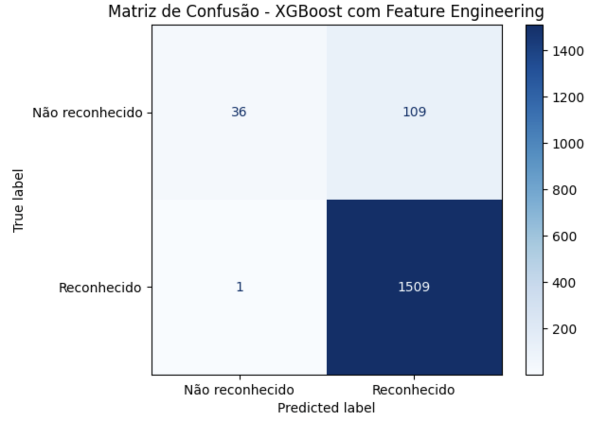
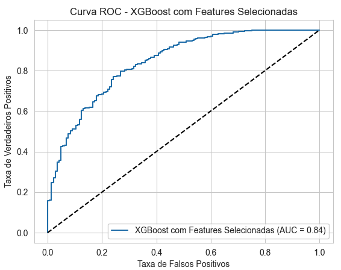
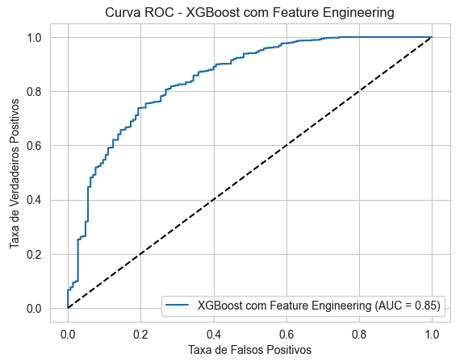

# Resultados do modelo XGBoost

Com base nas especificidades identificadas na base de dados, foram realizados testes utilizando quatro conjuntos de dados distintos:

1. Features agregadas com eventos ocorridos entre 2010 e 2017.
2. Features agregadas com eventos ocorridos entre 2018 e 2024.
3. Features desagregadas com eventos ocorridos entre 2010 e 2017.
4. Features desagregadas com eventos ocorridos entre 2018 e 2024.

> **Nota**: Mais detalhes sobre o pré-processamento dos dados podem ser verificados no capítulo "Pré-processamento".

As métricas analisadas foram:

- Accuracy (Acurácia): Proporção de previsões corretas (tanto positivas quanto negativas) em relação ao total de casos.
- Recall (Revocação): Proporção de casos positivos corretamente identificados pelo modelo. É crucial quando queremos capturar todos os casos positivos. No caso do reconhecimento federal, é um risco para o negócio que um evento não seja reconhecido quando o deveria ser.
- Precision (Precisão): Proporção de previsões positivas que realmente são positivas. Importante para minimizar falsos positivos.
- F1 Score: Média harmônica entre precisão e recall. É útil quando temos um desbalanceamento nas classes e queremos um equilíbrio entre precisão e recall.

## Modelos com features agregadas

- Weighted avg F1-score: **86,59%** no período 2010-2017 e **90,1%** no período 2018-2024
  - O modelo performou melhor nos dados mais recentes. Isso pode indicar que os padrões nos dados de 2018-2024 são mais consistentes ou que as features agregadas capturam melhor as características dos eventos nesse período.
- Baixo desempenho para a classe 'Não reconhecido'.
  - Apesar do bom F1-score geral, o modelo teve dificuldades em prever corretamente a classe 'Não reconhecido'. Isso significa que o modelo está tendo dificuldade em identificar corretamente os casos negativos.

## Modelos com features desagregadas

### 2010-2017

| Modelo                              | Precisão  (Não reconhecido) | Recall  (Não reconhecido) | F1-score  (Não reconhecido) | Precisão  (Reconhecido) | Recall  (Reconhecido) | F1-score  (Reconhecido) | Macro avg  F1-score | Weighted avg  F1-score |
|--------------------------------------|----------------------------|--------------------------|----------------------------|------------------------|-----------------------|------------------------|---------------------|----------------------------------------|
| Sem balanceamento                    | 0.687500                   | 0.152778                 | 0.250000                   | 0.908683               | 0.991830              | 0.948438               | 0.599219            | **0.874918**                         |
| Com SMOTE                            | 0.524590                   | 0.222222                 | 0.312195                   | 0.914308               | 0.976307              | 0.944291               | 0.628243            | **0.877754**                         |
| Com SMOTE e variáveis > -0,01        | 0.634146                   | 0.167742                 | 0.265306                   | 0.923169               | 0.990415              | 0.955610               | 0.610458            | **0.893403**                         |
| Com SMOTE e correlação < 0,5         | 0.543860                   | 0.200000                 | 0.292453                   | 0.925436               | 0.983387              | 0.953532               | 0.622992            | **0.893958**                         |

- **Uso do SMOTE**: A aplicação do SMOTE, que é uma técnica de balanceamento, ajudou o modelo a identificar melhor os casos da classe minoritária ('Não reconhecido'). Isso aumentou o F1-score dessa classe.
  - Houve uma queda na precisão, o que significa que o modelo passou a classificar mais casos como 'Não reconhecido', mas nem todos eram realmente dessa classe (aumentou o número de falsos positivos).
  - Essa situação representa um risco para o negócio
- **Seleção de Variáveis por Importância**: A exclusão de variáveis com importância < -0,01 não alterou significativamente o desempenho.
  - Isso sugere que essas variáveis não estavam contribuindo muito para o modelo.
- **Remoção de Variáveis Correlacionadas**: A remoção de variáveis altamente correlacionadas beneficiou o recall da classe minoritária, sem prejudicar a precisão.

### 2018-2024

| Modelo                              | Precisão (Não reconhecido) | Recall (Não reconhecido) | F1-score (Não reconhecido) | Precisão (Reconhecido) | Recall (Reconhecido) | F1-score (Reconhecido) | Macro avg F1-score | Weighted avg F1-score |
|--------------------------------------|----------------------------|--------------------------|----------------------------|------------------------|-----------------------|------------------------|---------------------|---------------------------------------|
| Sem balanceamento                    | 0.766667                   | 0.194915                 | 0.310811                   | 0.939258               | 0.995257              | 0.966447               | 0.638629            | **0.917912**                        |
| Com SMOTE                            | 0.648148                   | 0.296610                 | 0.406977                   | 0.946104               | 0.987127              | 0.966180               | 0.686579            | **0.924784**                        |
| Com SMOTE e variáveis > -0,01        | 0.648148                   | 0.296610                 | 0.406977                   | 0.946104               | 0.987127              | 0.966180               | 0.686579            | **0.924784**                        |
| Com SMOTE e correlação < 0,5         | 0.568966                   | 0.279661                 | 0.375000                   | 0.944661               | 0.983062              | 0.963479               | 0.669240            | **0.919916**                        |

- O modelo teve melhor desempenho na classe 'Não reconhecido' no período mais recente, indicando que os dados podem estar mais propícios para a identificação correta dessa classe.
- **Uso do SMOTE**: A técnica de balanceamento melhorou o recall e o F1-score da classe 'Não reconhecido', apesar de uma leve redução na precisão.
- **Seleção de Variáveis por Importância** e **Remoção de Variáveis Correlacionadas**: Assim como no período anterior, essas técnicas não tiveram um impacto significativo no desempenho, mas ajudaram a melhorar um pouco o recall da classe minoritária.

### Primeiras conclusões

- Impacto do SMOTE: Melhorou o recall e F1-score da classe 'Não reconhecido'.
- Seleção de Variáveis por Importância: Simplificação do modelo aumentou o recall e F1-score.
- Remoção de Variáveis Correlacionadas: Também melhorou o desempenho da classe minoritária, mantendo uma precisão ligeiramente maior.
- Os modelos de 2018-2024 mostraram melhor desempenho geral na classe minoritária.
- As técnicas de balanceamento e seleção de variáveis foram mais eficazes nos dados mais recentes.

## Modelos adicionais 2018-2024

Considerando os melhores resultados obtidos nos modelos testados com as variáveis desagregadas e com os dados 2018-2024, foram realizados testes adicionais.

Nesses testes adicionais, as seguintes variáveis foram agregadas:

| Nova Variável                               | Agregação                                                                                         |
|---------------------------------------------|---------------------------------------------------------------------------------------------------|
| DH_FERIDOS_ENFERMOS                         | DH_FERIDOS + DH_ENFERMOS                                                        |
| DH_DESABRIGADOS_DESALOJADOS                 | DH_DESABRIGADOS + DH_DESALOJADOS                                               ||
| DM_Uni_Habita_Danificadas_Destruidas        | DM_Uni Habita Danificadas + DM_Uni Habita Destruidas                           ||
| DM_Inst_Saude_Danificadas_Destruidas        | DM_Inst Saúde Danificadas + DM_Inst Saúde Destruidas                           ||
| DM_Inst_Ensino_Danificadas_Destruidas       | DM_Inst Ensino Danificadas + DM_Inst Ensino Destruidas                         | |
| DM_Inst_Servicos_Danificadas_Destruidas     | DM_Inst Serviços Danificadas + DM_Inst Serviços Destruidas                     ||
| DM_Inst_Comuni_Danificadas_Destruidas       | DM_Inst Comuni Danificadas + DM_Inst Comuni Destruidas                       | |
| DM_Obras_Infra_Danificadas_Destruidas       | DM_Obras de Infra Danificadas + DM_Obras de Infra Destruidas                  | |

Novas métricas foram analisadas nessa nova rodada de testes:

- AUC-ROC (Área Sob a Curva ROC): Mede a capacidade do modelo em distinguir entre classes. Valores mais próximos de 1 indicam melhor desempenho.
- AUC-PR (Área Sob a Curva de Precisão-Revocação): Similar ao AUC-ROC, mas é mais informativa em conjuntos de dados desbalanceados.

Os resultados são apresentados a seguir:

| Modelo                                                                           | accuracy_train | accuracy_test | recall_train | recall_test | precision | f1    | auc_roc | auc_pr |
|----------------------------------------------------------------------------------|----------------|---------------|--------------|-------------|-----------|-------|---------|--------|
| (1) XGBoost Base                                                                 | 0.996          | 0.935         | 1.000        | 0.993       | 0.940     | 0.966 | 0.824   | 0.975  |
| (2) XGBoost com Hiperparâmetros e balanceamento por pesos                        | 0.931          | 0.930         | 1.000        | 1.000       | 0.929     | 0.963 | 0.825   | 0.977  |
| (3) XGBoost com Hiperparâmetros, balanceamento por pesos e Features Selecionadas | 0.944          | 0.932         | 0.998        | 0.996       | 0.934     | 0.964 | 0.843   | 0.980  |
| (4) XGBoost com Hiperparâmetros, balanceamento por pesos e Feature Engineering   | 0.945          | 0.933         | 0.999        | 0.997       | 0.934     | 0.964 | 0.846   | 0.978  |

Matriz de confusão para os modelos (3) e (4)

|  |  |
|:---------------------------------------------------------------------------------------------------:|:-------------------------------------------------------------:|
|                              Matriz de Confusão - Seleção de features                               | Matriz de Confusão - Feature Engineering |

Curva ROC para os modelos (3) e (4)

|  |  |
|:-------------------------------------------------------------------------------------:|:----------------------------------------------------------------------------------:|
|                            Curva ROC - Seleção de features                            |                 git status         Curva ROC - Feature Engineering                 |

### Análise dos Resultados

1. XGBoost Base
- Acurácia e Recall Altos no Treino: A acurácia no treino é muito alta (99,6%), e o recall é 1.000, o que indica que o modelo está acertando praticamente todos os casos no treino.
- Possível Overfitting: A acurácia no teste é um pouco menor (93,5%), e o recall cai para 0.993. Essa diferença sugere que o modelo pode estar se ajustando demais aos dados de treino (overfitting).

2. XGBoost com Hiperparâmetros e balanceamento por pesos  
- Modelo em que se utilizou o balanceamento por pesos de acordo com a relação classe majoritária / classe minoritária
- Também se utilizou os hiperparâmetros sugeridos por Thakur (2020)
- *Redução do Overfitting*: A acurácia de treino diminuiu para 93,1%, aproximando-se da acurácia de teste (93,0%). Isso indica redução do overfitting.

3. XGBoost com Hiperparâmetros, balanceamento por pesos e features selecionadas
- Além do indicado em (2), nesse modelo selecionou-se as variáveis que contribuem acima da média para os resultados
- *Aumento no AUC-ROC e AUC-PR*: O AUC-ROC aumentou para 0.843, indicando que o modelo está melhor em distinguir entre as classes.

4. XGBoost com Feature Engineering:
- Além do indicado em (2), nesse modelo as variáveis que se referem a prejuízos foram agrupadas
- *Melhor AUC-ROC*: O AUC-ROC é o mais alto entre os modelos (0.846), sugerindo que o feature engineering (criação de novas features) melhorou a capacidade do modelo de distinguir entre as classes.

## Conclusões
- Redução de Overfitting com seleção de hiperparâmetros e seleção de Features:
  - Ajustar os hiperparâmetros e selecionar as features ajudou a reduzir o overfitting, equilibrando melhor a acurácia entre o treino e o teste.

- Feature Engineering Beneficiou o Modelo:
  - A criação de novas features agregadas aumentou o AUC-ROC, indicando uma melhor capacidade de diferenciação entre as classes. Isso pode significar que as novas features capturaram informações relevantes que não estavam claras antes.

- Desempenho Consistente na Classe Positiva:
O recall alto (próximo ou igual a 1.000) pode ser positivo se o objetivo é não perder nenhum caso positivo.

- Acurácia de Treino vs. Teste:
Modelos com acurácia de treino muito superior à de teste podem estar sofrendo de overfitting. Se for desejável que essas acurácias sejam próximas, o modelo com seleção de hiperparâmetros e agregação de algumas variáveis pode ser mais interessante do que os demais.